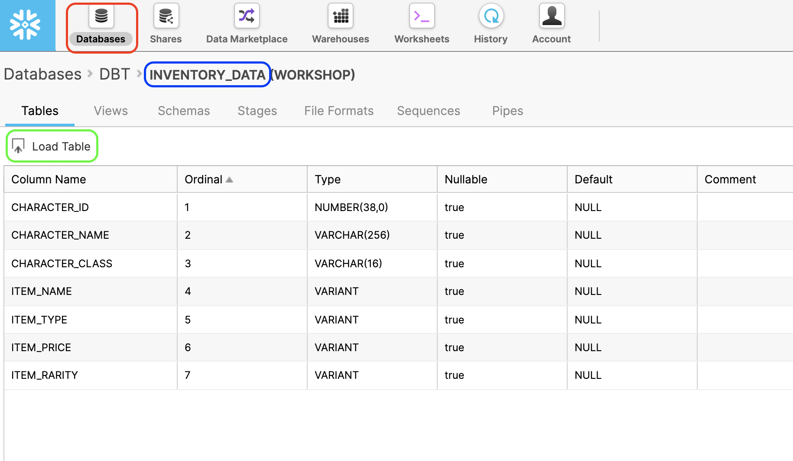

# Ejericio de JSON-CSV

## Instrucciones

1. En **Snowflake** crea una table con el siguiente codigo:

```sql
CREATE OR REPLACE TABLE CHARACTERS_ITEMS (
	ID NUMBER(38,0),
	USERNAME VARCHAR(256),
	CLASS VARCHAR(16),
	LEVEL NUMBER(38,0),
	HP NUMBER(38,0),
	INVENTORY VARIANT
);
```

2. Note que el tipo de la columna `INVENTORY` es `VARIANT`, esto nos permite cargar **semi-structured** como dato.

3. Despues de crear la tabla `CHARACTERS_ITEMS` pueden cargar los datos del archivo `characters_items.csv` ubicado en el folder `demo`. Esto lo pueden hacer por medio del UI de Snowflake. Ej:



4. Deben de desarrollar una solución dentro de **Snowflake** que inserte en una tabla los valores de la columna `INVENTORY` y asociarlos con el `ID` y `USERNAME` correspondiente. Pueden ver un ejemplo de los datos de entrada en el archivo `ejemplo_datos.csv` y otro ejemplo de la tabla de resultados en `ejemplo_resultado.csv`.

## Material de Apoyo

- [Querying Semi-structured Data](https://docs.snowflake.com/en/user-guide/querying-semistructured.html)
- [PARSE_JSON](https://docs.snowflake.com/en/sql-reference/functions/parse_json.html)

## Contacto

Si tienen preguntas me pueden contactar por los siguientes medios:
- Discord de Datachallenge 2022: **fabio-perezz#1415** 
- Correo: **[fabio_perez@hakkoda.io](mailto:fabio_perez@hakkoda.io)**